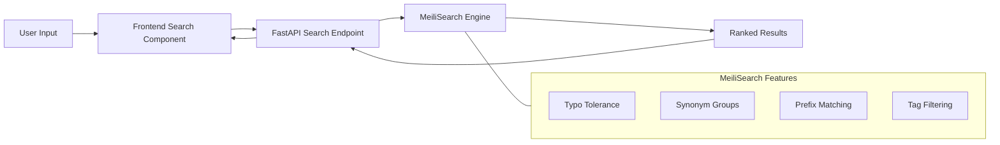

# 菜谱App 完整开发计划

## 技术栈选型


| 层级  | 技术  | 理由  |
| --- | --- | --- |


- **前端**: Vue 3 + Vite + Tailwind CSS + Naive UI + TipTap 富文本编辑器 -- Vue 3 轻量灵活，Tailwind 实现精美响应式样式（适配移动端+PC），Naive UI 提供高质量中文友好组件，TipTap 提供所见即所得编辑体验
- **后端**: Python FastAPI -- 高性能异步框架，自动生成 API 文档，开发效率高
- **数据库**: PostgreSQL -- 稳定可靠，原生支持全文检索，配合 MeiliSearch 使用
- **搜索引擎**: MeiliSearch -- 轻量级搜索引擎，**原生支持**模糊搜索、错字容忍、同义词、前缀匹配、标签过滤，完美匹配需求
- **部署**: Docker Compose 一键部署（前端 Nginx + 后端 FastAPI + PostgreSQL + MeiliSearch）

## 数据库设计

```sql
-- 菜谱主表
recipes (
  id            SERIAL PRIMARY KEY,
  name          VARCHAR(100) NOT NULL,       -- 名称
  description   TEXT,                         -- 简介（富文本 HTML，TipTap 编辑）
  steps         TEXT,                         -- 烹饪步骤（富文本 HTML，TipTap 编辑，一段完整描述）
  tips          TEXT,                         -- 小贴士
  created_at    TIMESTAMP DEFAULT NOW(),
  updated_at    TIMESTAMP DEFAULT NOW()
)

-- 菜谱图片（一对多，支持多张封面图或无图）
recipe_images (
  id            SERIAL PRIMARY KEY,
  recipe_id     INT REFERENCES recipes(id) ON DELETE CASCADE,
  image_path    VARCHAR(500) NOT NULL,        -- 图片路径
  sort_order    SMALLINT DEFAULT 0            -- 排序序号
)

-- 食材主表（全局唯一食材清单，含营养信息）
ingredients (
  id            SERIAL PRIMARY KEY,
  name          VARCHAR(100) UNIQUE NOT NULL, -- 食材名（西红柿、盐、酱油...）
  unit          VARCHAR(20) NOT NULL,         -- 标准计量单位（克、个、毫升、片...）
  calorie       REAL                          -- 每单位卡路里（kcal），可为空（如盐=0、未知食材）
)

-- 菜谱-食材关联（多对多，用量信息在此表，单位继承食材主表）
recipe_ingredients (
  id            SERIAL PRIMARY KEY,
  recipe_id     INT REFERENCES recipes(id) ON DELETE CASCADE,
  ingredient_id INT REFERENCES ingredients(id),
  amount        VARCHAR(50),                  -- 用量（"2", "500", "适量"），单位自动取食材主表的 unit
  category      VARCHAR(20) DEFAULT '主料'    -- 在本菜谱中的角色：主料/辅料/调料
)

-- 标签表
tags (
  id            SERIAL PRIMARY KEY,
  name          VARCHAR(50) UNIQUE NOT NULL,  -- 如：早餐、荤菜、川菜
  category      VARCHAR(30)                   -- 标签分类：场景/菜系/口味/食材类型
)

-- 菜谱-标签关联（多对多）
recipe_tags (
  recipe_id     INT REFERENCES recipes(id) ON DELETE CASCADE,
  tag_id        INT REFERENCES tags(id) ON DELETE CASCADE,
  PRIMARY KEY (recipe_id, tag_id)
)
```

**关键设计说明**：

- **封面图**: 独立成表 `recipe_images`，支持 0~N 张图片，通过 `sort_order` 控制显示顺序
- **烹饪步骤**: `recipes.steps` 为 TEXT 字段存储 HTML 富文本，使用 TipTap 编辑器实现所见即所得编辑，用一段连贯的文字描述整个烹饪过程
- **食材拆分**: `ingredients` 为全局食材主表（每种食材只一条记录），包含标准单位（unit）和每单位卡路里（calorie）；`recipe_ingredients` 为关联表承载用量 + 角色分类，**不再单独存单位**，自动使用食材主表中的标准单位
- **卡路里自动计算**: 前端/后端根据 `recipe_ingredients.amount`（可解析为数值时）乘以 `ingredients.calorie` 自动求和，得出整道菜的估算卡路里。amount 为"适量"等非数值时跳过计算
- **已移除字段**: servings、prep_time、cook_time、difficulty（按用户要求精简）

## 搜索方案（核心功能）

使用 MeiliSearch 作为搜索引擎，方案如下：

1. **索引内容与优先级**: 通过 MeiliSearch 的 `searchableAttributes` 按优先级排序索引字段：
  - **name**（最高优先级）-- 菜谱名称，搜索"盐焗鸡"优先匹配名称
  - **main_ingredients** -- **仅索引主料和辅料**，排除调料类食材。避免搜索"盐焗鸡"误匹配所有含"盐"调料的菜谱。优先级高于标签，因为按食材搜菜是更常见的使用场景
  - **tags** -- 标签名
  - **不索引 description** -- 描述字段为富文本，含大量噪声（HTML标签、格式文本），加入搜索弊大于利；菜谱名 + 标签 + 主料已能覆盖绝大多数搜索场景
2. **同义词配置**: 在 MeiliSearch 中配置同义词组，如 `["番茄", "西红柿"]`、`["土豆", "马铃薯"]`、`["鸡蛋", "蛋"]` 等，后端提供 API 管理同义词
3. **错字容忍**: MeiliSearch 内置 typo tolerance，自动处理输入错字
4. **前缀匹配**: MeiliSearch 默认支持，输入"西红"即可匹配"西红柿炒鸡蛋"
5. **标签过滤**: 使用 MeiliSearch 的 filterable attributes 实现标签组合筛选
6. **搜索流程**: 前端输入 -> 实时请求 MeiliSearch (通过后端代理) -> 返回排序结果
7. **数据同步**: 后端在菜谱增删改时同步更新 MeiliSearch 索引，同步文档结构为 `{id, name, tags: [...], main_ingredients: [仅主料+辅料名]}`




## 导出/导入方案

格式采用 **ZIP 包**，包含：

- `recipe.json` -- 菜谱元数据（名称、描述、步骤文字、食材、标签等）
- `images/` 目录 -- 封面图和步骤图文件

```json
{
  "version": "1.0",
  "recipe": {
    "name": "西红柿炒鸡蛋",
    "description": "<p>经典家常菜...</p>",
    "tips": "鸡蛋先炒会更嫩",
    "steps": "<p>西红柿切块备用。鸡蛋打散加少许盐。<strong>热锅凉油</strong>炒鸡蛋至凝固盛出...</p>",
    "images": ["images/cover_1.jpg", "images/cover_2.jpg"],
    "ingredients": [
      {"name": "西红柿", "amount": "2", "category": "主料"},
      {"name": "鸡蛋", "amount": "3", "category": "主料"},
      {"name": "盐", "amount": "适量", "category": "调料"}
    ],
    "tags": ["家常菜", "快手菜"]
  }
}
```

## 分享方案

由于个人项目不便接入 QQ/微信官方 SDK（需企业认证），采用**实用替代方案**：

1. **生成精美长图**: 后端使用 Playwright 或 html2image 将菜谱详情渲染为长图
2. **下载/保存**: 用户点击"分享"按钮后生成长图，可直接保存到手机相册
3. **跳转分享**: 通过系统 Web Share API（移动端浏览器支持）调起系统分享面板，可选择分享到微信/QQ 等任意应用
4. **分享链接**: 同时生成菜谱的短链接，附在长图底部（含二维码）

## 前端页面设计

按用户要求**前端先行**，使用 Mock 数据完成 UI 设计后再对接后端。

主要页面（**响应式设计，同时适配移动端和 PC 端**，使用 Tailwind CSS 断点系统）：

1. **首页**: 顶部搜索栏 + 标签快捷筛选 + 菜谱卡片网格（PC 多列 / 移动端单列或双列）
2. **搜索页**: 实时搜索建议下拉 + 标签多选过滤 + 搜索结果列表
3. **菜谱详情页**: 封面图轮播（支持多图）+ 食材清单（主料/辅料/调料分组显示）+ 步骤列表 + 小贴士 + 分享按钮
4. **管理后台**: 菜谱列表（支持搜索/分页）+ 新建/编辑表单 + 导入/导出操作
  - 编辑器采用 **TipTap**（基于 ProseMirror 的 Vue 3 富文本编辑器）实现所见即所得编辑
  - 描述字段和烹饪步骤字段均使用 TipTap 富文本编辑器（输出 HTML）
  - 图片支持拖拽上传和预览
  - 食材选择支持从全局食材库搜索/自动补全，自动带出单位；新增食材时可直接创建
  - 自动显示该菜谱的估算总卡路里
5. **标签管理**: 标签分类管理页面
6. **食材管理**: 全局食材列表管理（查看、合并重复食材等）

## 项目结构

```
recipe/
├── frontend/                  # Vue 3 前端
│   ├── src/
│   │   ├── views/             # 页面组件
│   │   ├── components/        # 公共组件
│   │   ├── api/               # API 请求封装
│   │   ├── stores/            # Pinia 状态管理
│   │   ├── router/            # 路由
│   │   └── mock/              # Mock 数据（前端先行阶段使用）
│   └── ...
├── backend/                   # FastAPI 后端
│   ├── app/
│   │   ├── api/               # 路由
│   │   ├── models/            # SQLAlchemy 模型
│   │   ├── schemas/           # Pydantic 模型
│   │   ├── services/          # 业务逻辑（搜索、导入导出、分享等）
│   │   └── core/              # 配置、数据库连接
│   └── requirements.txt
├── docker-compose.yml         # 一键部署
└── project.md
```

## 开发顺序

按照用户要求，**先设计前端 UI，确认后再开发后端**：

**Phase 1 -- 前端 UI 设计（Mock 数据）**

1. 搭建 Vue 3 + Vite + Tailwind CSS + Naive UI 项目
2. 创建 Mock 数据模拟菜谱
3. 逐页实现：首页 -> 详情页 -> 搜索页 -> 管理后台
4. 用户确认 UI 设计

**Phase 2 -- 后端 API 开发**
5. 搭建 FastAPI 项目 + PostgreSQL + MeiliSearch (Docker Compose)
6. 实现数据库模型和 CRUD API
7. 实现搜索功能（MeiliSearch 集成 + 同义词配置）
8. 实现图片上传

**Phase 3 -- 前后端对接 + 高级功能**
9. 前端对接后端 API，替换 Mock 数据
10. 实现导入/导出功能
11. 实现分享长图生成
12. 完善细节（加载动画、错误处理、响应式适配）

**Phase 4 -- 部署**
13. 编写 Docker Compose 配置
14. 编写部署文档